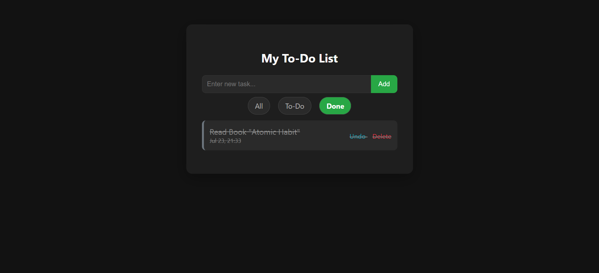

# PHP To-Do List

A simple task manager built using PHP and MySQL.

## Features
- Add, delete, and toggle tasks
- Dark mode theme
- Filter by All / To-Do / Done

## How to run
1. Clone this repo
2. Import the `todo_app.sql` into MySQL
3. Update `includes/db.php` with your local credentials
4. Run in a local server (XAMPP or similar)
